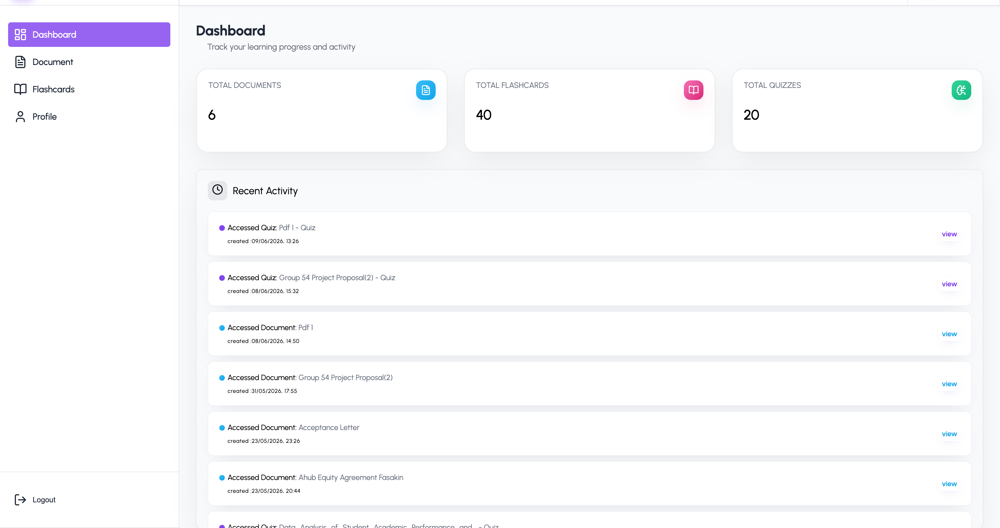
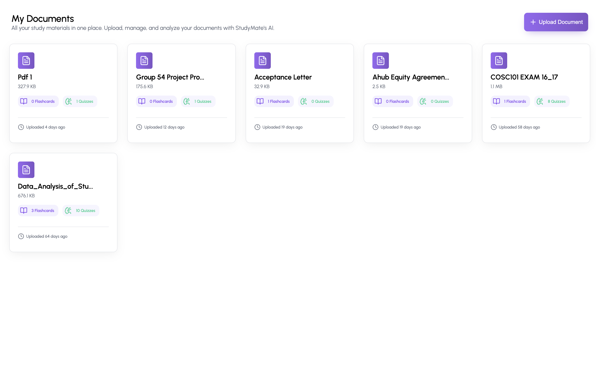

# 🚀 StudyMate
**Transforming passive reading into interactive, AI-driven learning.**

## 📖 Overview
For students, digesting dense academic PDFs often results in passive reading and poor knowledge retention. StudyMate is a full-stack web application engineered to solve this by automating the creation of active recall materials. By uploading course documents, the system leverages AI text extraction to instantly generate summaries, interactive quizzes, and flashcards.

Developed as my inaugural full-stack project, StudyMate serves as a functional MVP that demonstrates end-to-end system design, RESTful API development, and the integration of artificial intelligence into a seamless user experience.

## ✨ Key Features
- **Intelligent PDF Processing:** Robust file upload system that extracts and sanitizes raw text from complex academic documents.
- **Automated Summarization:** Condenses lengthy chapters into digestible, high-yield study notes.
- **Dynamic Active Recall Generation:** Programmatically generates targeted flashcards and multiple-choice quizzes based on the extracted context.
- **Contextual AI Chatbot:** An embedded assistant that allows users to query specific concepts directly related to their uploaded materials.
- **Responsive & Accessible UI:** A clean, minimal interface styled strictly with SCSS for optimal performance across desktop and mobile.

## 🧠 Architecture / How It Works
The application follows a standard MERN-like client-server architecture with asynchronous AI processing:
- **Client (React):** Handles state management and file uploads via multipart form data.
- **Server (Express/Node.js):** Receives the payload, utilizes a parsing buffer to extract text, and handles routing.
- **AI Layer:** The sanitized text is dispatched to the Gemini AI service with strict prompt engineering to return structured JSON data (quizzes/flashcards).
- **Database (MongoDB):** The processed materials are stored relationally for future retrieval and progress tracking.

## 🛠️ Tech Stack

**Frontend**
- React.js (Hooks, Context API)
- SCSS (Modular component styling, BEM methodology)
- Axios (HTTP client)

**Backend**
- Node.js & Express.js (REST API architecture)
- Multer (Multipart/form-data handling for PDF uploads)
- Cloudinary (PDF cloud storage)
- PDF-Parse (Server-side text extraction)

**Database & Deployment**
- MongoDB / Mongoose (Data modeling)
- Vercel (Frontend hosting)
- Render (Backend hosting)

## 📸 Screenshots

| Dashboard | Document List |
| :---: | :---: |
|  |  |